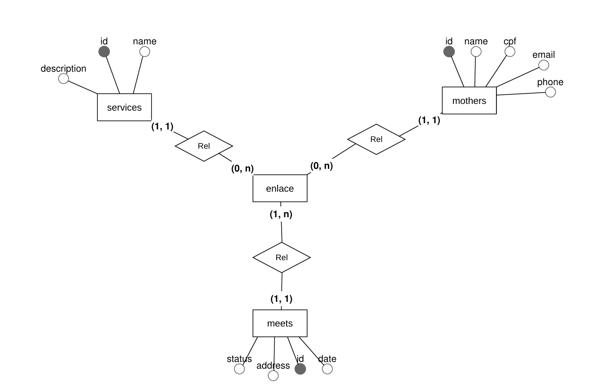
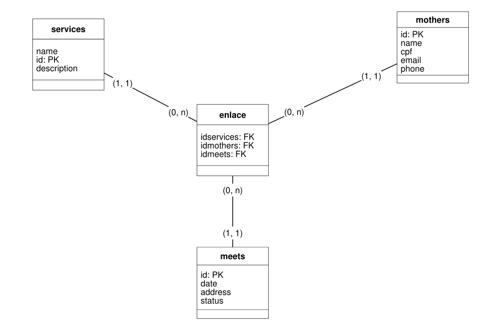

# Banco de Dados

## Modelo Conceitual



---

## Modelo Logico



---

## Modelo Físico

```bash

CREATE TABLE mothers (
  id INT PRIMARY KEY AUTO_INCREMENT,
  name VARCHAR(100) NOT NULL,
  cpf VARCHAR(14) NOT NULL UNIQUE,
  email VARCHAR(100) NOT NULL UNIQUE,
  phone VARCHAR(20) NOT NULL UNIQUE,
  birthday DATE NOT NULL,
  status ENUM('active', 'inactive') DEFAULT 'active'
);

CREATE TABLE services (
  id INT PRIMARY KEY AUTO_INCREMENT,
  name VARCHAR(100) NOT NULL UNIQUE,
  description TEXT,
  status ENUM('active', 'inactive') DEFAULT 'active'
);

CREATE TABLE meets (
  id INT PRIMARY KEY AUTO_INCREMENT,
  date TIMESTAMP NOT NULL,
  address VARCHAR(200) NOT NULL,
  status ENUM('pending','canceled', 'completed') DEFAULT 'pending'
);

CREATE TABLE enlace (
  idservices INT,
  idmothers INT,
  idmeets INT,
  PRIMARY KEY (idservices, idmothers, idmeets),
  FOREIGN KEY (idservices) REFERENCES services(id),
  FOREIGN KEY (idmothers) REFERENCES mothers(id),
  FOREIGN KEY (idmeets) REFERENCES meets(id)
);

```
